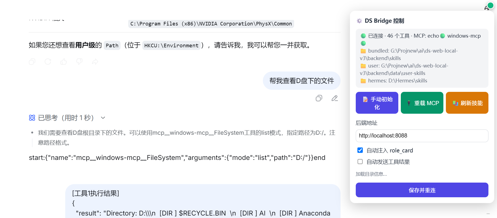

# DS Web Local

可插拔的本地 Agent 能力中台 —— 让【网页版 DeepSeek】获得本地 Agent 能力（MCP / 文件操作 / 技能 / 桌面自动化），也让本地 agent（Hermes / Claude Desktop）复用同一套工具。

> ⚠️ 本项目调用 DeepSeek 网页版的能力是通过浏览器油猴脚本桥接实现，仅限个人学习研究使用。

## 特性

- 🔌 **MCP 双角色**：作为 MCP 客户端接入外部 MCP 服务（stdio / streamable-http），聚合后统一暴露
- 🛠️ **24 个内置工具**：文件读写 / 目录 / 搜索 / Git / 终端 / 审批 / 技能加载 / 凭据引用 / Web 搜索
- 🖥️ **Windows 桌面自动化**：窗口管理、点击/输入/截图、注册表、进程、系统通知（windows-mcp）
- 🧩 **技能系统**：SKILL.md 多根发现（bundled / user / custom / hermes 只读源）、按需加载、导入导出
- 🔑 **凭据引用模型**：配置只存引用不存值，环境变量遮蔽，控制台永不显示明文
- 📜 **管理控制台**：React SPA —— MCP 服务 / 技能 / 工具日志 / 凭据 / 审批 / 设置
- 🔁 **高可靠桥接**：fetch/XHR 劫持 + DOM 观察三通道监听、四级 JSON 宽容解析、状态机重连

## 架构

```
┌─────────────────┐   Tampermonkey 油猴脚本    ┌──────────────────┐
│  网页版 DeepSeek │ ◄────────────────────────► │                  │
│  (chat.deepseek)│   start:{...}end 工具协议    │   本地后端 :8088  │
└─────────────────┘                            │  FastAPI + MCP   │
                                               │  工具聚合中心     │
┌─────────────────┐   HTTP (console SPA)      │                  │
│  管理控制台      │ ◄────────────────────────► │  技能 / 凭据      │
│  (React)        │                            │  审批 / 事件流    │
└─────────────────┘                            └────────┬─────────┘
                                                        │ MCP (stdio/http)
                                          ┌─────────────┼─────────────┐
                                          ▼             ▼             ▼
                                    windows-mcp   外部 MCP 服务    Hermes 技能库
```

| 部分 | 目录 | 职责 |
|---|---|---|
| 本地后端 | `backend/` | FastAPI + MCP 工具聚合中心（依赖 Python 3.11+） |
| 桥接层 | `bridge/` | 网页版桥接（站点无关引擎 + DeepSeek 适配器），`build.py` 打包 user.js |
| 管理控制台 | `console/` | React SPA（Vite + Tailwind），构建产物由后端静态托管 |

## 界面预览



## 快速开始

> 非开发者/第一次接触？先看 [用户指南（图文步骤）](docs/USER_GUIDE.md)。

### 1. 安装依赖

| 依赖 | 用途 | 安装方式 |
|---|---|---|
| Python 3.11+ | 后端运行 | [python.org](https://www.python.org/) 或 [uv](https://docs.astral.sh/uv/) |
| pip / uv | Python 包管理 | pip 随 Python 自带；uv: `pip install uv` |
| Node.js 20+ | 控制台构建 + 桥接自测 | [nodejs.org](https://nodejs.org/) |
| uvx（可选） | windows-mcp 桌面自动化服务 | 随 uv 安装 |
| Tampermonkey | 油猴脚本宿主（浏览器） | [tampermonkey.net](https://www.tampermonkey.net/) |

后端 Python 依赖（fastapi / uvicorn / mcp / loguru / pydantic / pyyaml / httpx / slowapi 等）：

```bash
cd backend
pip install -r requirements.txt        # 或: uv sync --extra dev
```

> windows-mcp 为**可选**（Windows 桌面自动化：窗口/点击/截图/注册表）。不需要桌面自动化的用户可删除 `backend/config/mcp.json` 中的 `windows-mcp` 服务条目，其余功能不受影响。

```bash
# 控制台（可选，若用预构建 dist 可跳过）
cd ../console
npm install
npm run build
```

### 2. 启动后端

```bash
cd backend
python main.py
# 或 Windows: 双击 start.bat
```

启动后：
- 后端: http://127.0.0.1:8088 （`/health` 检查）
- 控制台: http://127.0.0.1:8088/console

### 3. 安装桥接脚本（网页版 DeepSeek）

1. 安装 [Tampermonkey](https://www.tampermonkey.org/) 浏览器扩展
2. 新建脚本，粘贴 `bridge/ds-bridge.user.js` 内容（或重新运行 `python bridge/build.py` 生成最新版）
3. 打开 https://chat.deepseek.com —— 右上角出现状态圆点（灰 → 绿=已连接）
4. **新建对话**：自动注入 role_card（系统规范 + 工具清单 + 调用示例）
5. 直接自然语言对话即可，例如：
   - "查看 G:/Download 目录下最大的文件"
   - "启动 D:/games/xxx.exe"
   - "读取 HKCU:/Environment 的 Path 注册表值"

### 4. 配置 MCP 服务

编辑 `backend/config/mcp.json` 添加服务（或控制台「MCP 服务」页操作）：

```json
{
  "services": {
    "my-server": {
      "transport": "stdio",
      "command": "npx",
      "args": ["-y", "my-mcp-server"],
      "auto_start": true
    }
  }
}
```

## 工作原理（桥接协议）

模型在对话中输出约定格式的工具调用，脚本捕获后调本地后端执行：

```
start:{"name":"list_directory","arguments":{"path":"G:/Download"}}end
```

- **三通道监听**：fetch 劫持 + XHR 劫持 + DOM 观察（DeepSeek 页面怎么改都不怕）
- **四级宽容解析**：SSE 转义反转义 → Windows 路径 `\D` 非法转义修复 → 值内未转义引号状态机 → 流式中间态容错
- **结果回填**：执行结果直接填入输入框，按发送键提交给模型（自动发送可选，注意可能触发风控）
- **超长结果外置**：>20KB 的结果自动落盘 `data/tmp/`，回填摘要 + 路径，模型用 read_file 按需读取

## 常见问题

**Q: 模型不调用工具 / 参数名猜错？**
A: 刷新页面后**新建对话**（role_card 注入到新会话）；role_card 已含参数名提示与调用示例，模型应直接照抄。

**Q: 工具结果发送后模型没反应？**
A: 确认输入框出现绿色高亮后**按了发送键**；自动发送开关（面板右上角圆点）开启后无需手按（可能触发 DeepSeek 风控）。

**Q: 想从局域网/其他机器访问？**
A: 改 `backend/config/settings.yaml` 的 `server.host` 为 `0.0.0.0`，并务必开启 `security.auth_enabled: true` + 设置 `auth_token`。

**Q: 改了 role_card / 工具配置不生效？**
A: role_card 在新建对话时注入；后端配置（mcp.json/settings.yaml）改后重启后端；技能目录变更由监听线程 5s 内自动感知。

**Q: 乱码？**
A: 读文本文件请让模型用 read_file（自动检测 UTF-8/GBK）；PowerShell Get-Content 在中文 Windows 默认 GBK 会乱码。

## 开发

```bash
# 后端测试（151 用例）
cd backend && python -m pytest

# 桥接解析自测（14 用例，Node）
node bridge/selftest.js

# 重新打包油猴脚本（改 bridge/ 源码后）
python bridge/build.py
```

## 安全说明

- 默认仅监听 `127.0.0.1`，凭据文件 `data/.credentials.yaml` 权限 0600，会话事件敏感键递归脱敏
- 局域网/公网暴露前请开启认证（见上）；工具审批（terminal 等敏感操作）默认关闭，可在 settings.yaml 开启
- 本项目仅聚合/转发工具调用，**不包含**任何 DeepSeek 服务端能力；网页版行为受其官方条款约束

## License

[MIT](LICENSE)
